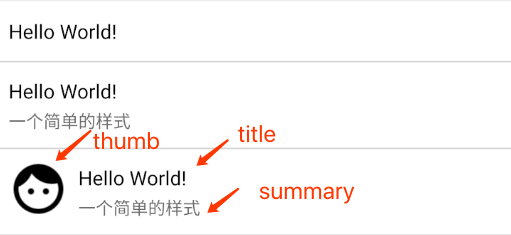
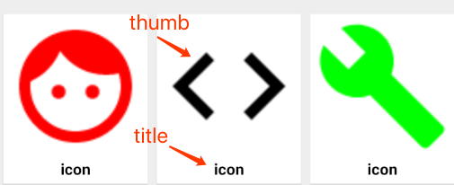
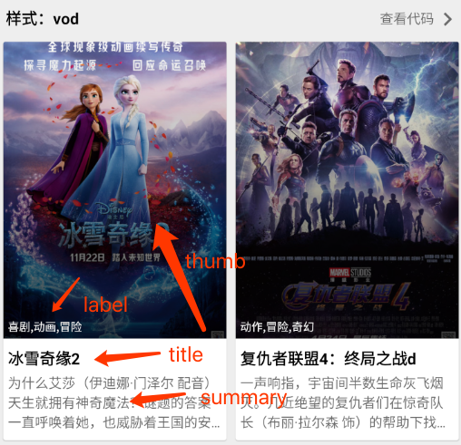
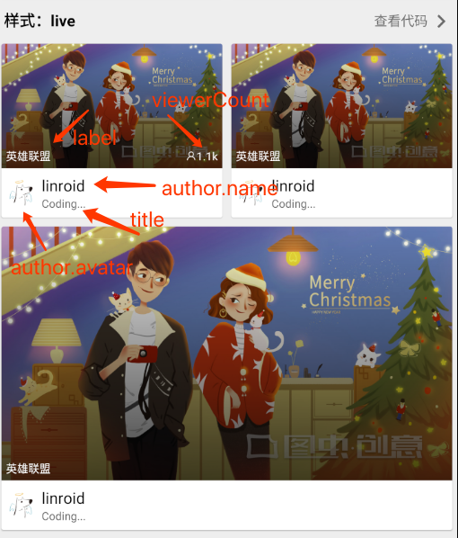
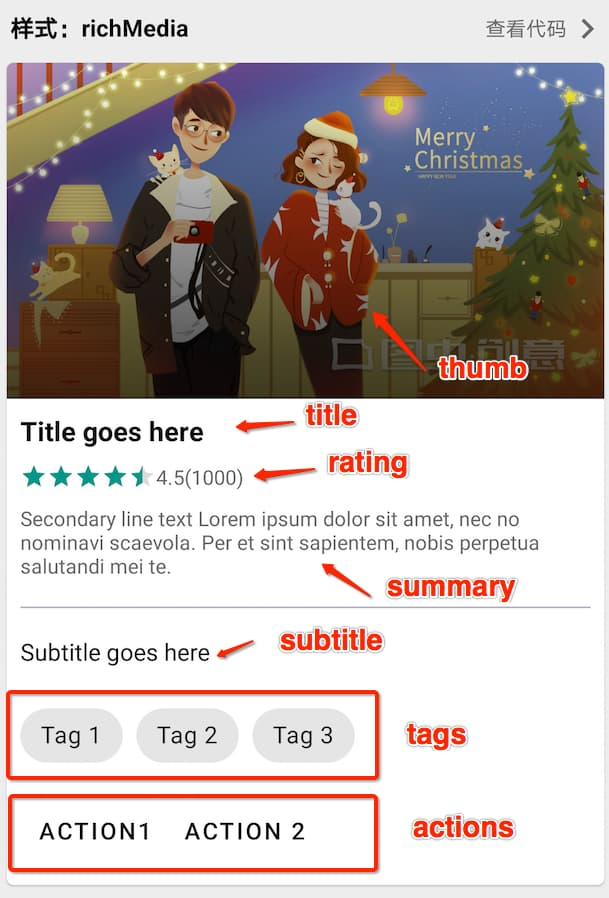
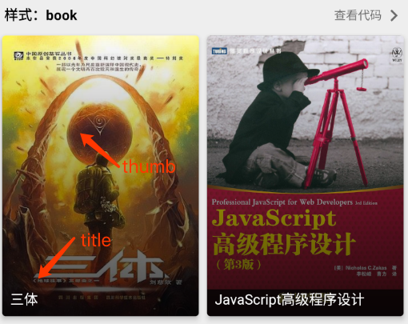
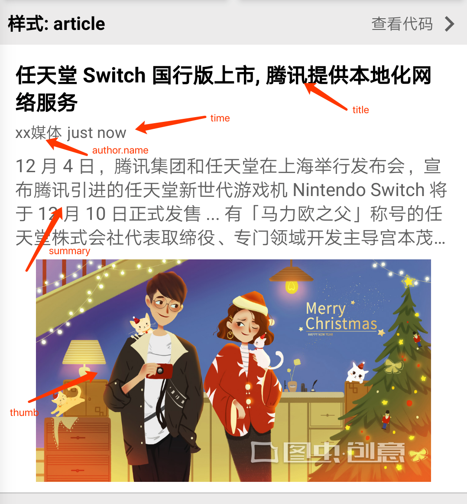

# list 组件

> 适合展示列表类的数据


## 样式

- [simple(简约)](#simple)
- [live(直播)](#live)
- [icon(图标)](#icon)
- [gallery(图库)](#gallery)
- [article(文章)](#article)
- [richMedia(富媒体)](#richMedia)
- [category(分类)](#category)
- [vod(影片)](#vod)
- [book(书籍)](#book)
- [richContent(富文本)](#richContent)
- [chips(碎片)](#chips)
- [dashboard(仪表盘)](#dashboard)

### simple

```javascript
module.exports = {
  type: 'list',
  style: 'simple',
  async fetch({ args, page }) {
    return [
      {
        title: 'Hello World!',
        style: 'simple'
      },
      {
        title: 'Hello World!',
        style: 'simple',
        summary: '一个简单的样式'
      },
      {
        title: 'Hello World!',
        style: 'simple',
        image: $icon('face', 'black'),
        summary: '一个简单的样式'
      }
    ]
  }
}
```

<button class="run-button" onclick="sendDoraEvent('$router.to','list_simple')">点击运行</button>

### label

```javascript
module.exports = {
  type: 'list',
  async fetch({ args, page }) {
    return [
      {
        title: 'Label 1',
        style: 'label'
      },
      {
        title: 'Label 2',
        style: 'label'
      },
      {
        title: 'Label 3',
        style: 'label'
      },
      {
        title: 'Label 4',
        style: 'label'
      }
    ]
  }
}
```

<button class="run-button" onclick="sendDoraEvent('$router.to','list_label')">点击运行</button>

### chips

```javascript
module.exports = {
  type: 'list',
  async fetch({ args, page }) {
    return [
      {
        title: 'Chips title',
        style: 'chips',
        actions: [
          {
            title: 'Action 1'
          },
          {
            title: 'Action 2'
          },
          {
            title: 'Action 3'
          },
          {
            title: 'Action 4'
          }
        ]
      }
    ]
  }
}
```

<button class="run-button" onclick="sendDoraEvent('$router.to','list_chips')">点击运行</button>

### icon

```javascript
module.exports = {
  type: 'list',
  async fetch({ args, page }) {
    return [
      {
        title: 'icon',
        style: 'icon',
        image: $icon('face', 'red')
      },
      {
        title: 'icon',
        style: 'icon',
        image: $icon('code')
      },
      {
        title: 'icon',
        style: 'icon',
        image: $icon('build', 'green')
      }
    ]
  }
}
```

<button class="run-button" onclick="sendDoraEvent('$router.to','list_icon')">点击运行</button>

### dashboard

```javascript
module.exports = {
  type: 'list',
  async fetch({ args, page }) {
    return [
      {
        style: 'dashboard',
        image: $icon('memory'),
        title: '内存使用',
        summary: '1024 MB',
        color: '#8B355E',
        textColor: 'white'
      },
      {
        style: 'dashboard',
        image: $icon('battery_alert'),
        title: '电池使用',
        summary: '1024MB',
        color: '#81AF37',
        textColor: 'white'
      }
    ]
  }
}
```

<button class="run-button" onclick="sendDoraEvent('$router.to','list_dashboard')">点击运行</button>

### vod

```javascript
module.exports = {
  type: 'list',
  async fetch({ args, page }) {
    return [
      {
        title: '冰雪奇缘2',
        style: 'vod',
        thumb:
          'https://p0.meituan.net/moviemachine/58ee13be6dc60bf5e636cf915bbbaaa55787785.jpg@464w_644h_1e_1c',
        label: '喜剧,动画,冒险',
        summary:
          '为什么艾莎（伊迪娜·门泽尔 配音）天生就拥有神奇魔法？谜题的答案一直呼唤着她，也威胁着王国的安全。她将和安娜（克里斯汀·贝尔 配音）、克斯托夫（乔纳森·格罗夫 配音）、雪宝（乔什·盖德 配音）和驯鹿斯特共同开启一场非凡的冒险旅程。艾莎曾担心世界不能接受自己的冰雪魔法，但在《冰雪奇缘2》中她却必须祈祷自己的魔法足够强大，能够拯救世界。本片由奥斯卡金牌团队打造——导演珍妮弗·李和克里斯·巴克、制作人彼得·戴尔·维克以及词曲作者克里斯汀·安德森-洛佩兹及罗伯特·洛佩兹悉数回归，原配音班底伊迪娜·门泽尔、克里斯汀·贝尔、乔纳森·格罗夫和乔什·盖德再度加盟。华特迪士尼动画工作室荣誉出品《冰雪奇缘2》将于2019年11月22日登陆北美院线。'
      },
      {
        title: '复仇者联盟4：终局之战d',
        style: 'vod',
        thumb:
          'https://p0.meituan.net/moviemachine/f7d2ad70eb79d6d9b8a197713db9b8c41711752.jpg@464w_644h_1e_1c',
        label: '动作,冒险,奇幻',
        summary:
          '一声响指，宇宙间半数生命灰飞烟灭。几近绝望的复仇者们在惊奇队长（布丽·拉尔森 饰）的帮助下找到灭霸（乔什·布洛林 饰）归隐之处，却得知六颗无限宝石均被销毁，希望彻底破灭。如是过了五年，迷失在量子领域的蚁人（保罗·路德 饰）意外回到现实世界，他的出现为幸存的复仇者们点燃了希望。与美国队长（克里斯·埃文斯 饰）冰释前嫌的托尼（小罗伯特·唐尼 饰）找到了穿越时空的方法，星散各地的超级英雄再度集结，他们分别穿越不同的时代去搜集无限宝石。而在这一过程中，平行宇宙的灭霸察觉了他们的计划。 注定要载入史册的最终决战，超级英雄们为了心中恪守的信念前仆后继……'
      }
    ]
  }
}
```

<button class="run-button" onclick="sendDoraEvent('$router.to','list_vod')">点击运行</button>

### live

```javascript
module.exports = {
  type: 'list',
  async fetch({ args, page }) {
    return [
      {
        title: 'Coding...',
        style: 'live',
        image:
          'https://ae01.alicdn.com/kf/Hfb994821e07f4b68a8691d6116bdd3157.jpeg',
        label: '英雄联盟',
        viewerCount: '1.1k',
        author: {
          name: 'linroid',
          avatar: 'https://linroid.com/avatar.png'
        }
      },
      {
        title: 'Coding...',
        style: 'live',
        image:
          'https://ae01.alicdn.com/kf/Hfb994821e07f4b68a8691d6116bdd3157.jpeg',
        label: '英雄联盟',
        author: {
          name: 'linroid',
          avatar: 'https://linroid.com/avatar.png'
        }
      },
      {
        title: 'Coding...',
        style: 'live',
        image:
          'https://ae01.alicdn.com/kf/Ha7e5289304d14988bd76bb818c179204c.jpg',
        spanCount: 12,
        label: '英雄联盟',
        author: {
          name: 'linroid',
          avatar: 'https://linroid.com/avatar.png'
        }
      }
    ]
  }
}
```

<button class="run-button" onclick="sendDoraEvent('$router.to','list_live')">点击运行</button>

### category

```javascript
module.exports = {
  type: 'list',
  async fetch({ args, page }) {
    return [
      {
        title: '分类1',
        style: 'category'
      },
      {
        title: 'Label 1',
        style: 'label'
      },
      {
        title: '分类2',
        style: 'category'
      },
      {
        title: 'Label 2',
        style: 'label'
      }
    ]
  }
}
```

<button class="run-button" onclick="sendDoraEvent('$router.to','list_category')">点击运行</button>

### richMedia

```javascript
module.exports = {
  type: 'list',
  async fetch({ args, page }) {
    return [
      {
        title: 'Title goes here',
        style: 'richMedia',
        image: 'https://weiliicimg9.pstatp.com/weili/l/778002376200945690.webp',
        rating: {
          score: 4.5,
          total: 5,
          text: '4.5(1000)'
        },
        summary:
          'Secondary line text Lorem ipsum dolor sit amet, nec no nominavi scaevola. Per et sint sapientem, nobis perpetua salutandi mei te.',
        subtitle: 'Subtitle goes here',
        tags: [
          {
            title: 'Tag 1',
            onClick: this.simpleOnClick
          },
          {
            title: 'Tag 2',
            onClick: this.simpleOnClick
          },
          {
            title: 'Tag 3',
            onClick: this.simpleOnClick
          }
        ],
        actions: [
          {
            title: 'Action1',
            onClick: this.simpleOnClick
          },
          {
            title: 'Action 2',
            onClick: this.simpleOnClick
          }
        ]
      }
    ]
  }
}
```

<button class="run-button" onclick="sendDoraEvent('$router.to','list_richMedia')">点击运行</button>

### gallery

```javascript
module.exports = {
  type: 'list',
  async fetch({ args, page }) {
    return [
      {
        title: 'gallery',
        style: 'gallery',
        image: 'https://weiliicimg9.pstatp.com/weili/l/778002376200945690.webp',
        author: {
          name: 'linroid',
          avatar: 'https://avatars0.githubusercontent.com/u/3192142?s=460&v=4'
        }
      }
    ]
  }
}
```

<button class="run-button" onclick="sendDoraEvent('$router.to','list_gallery')">点击运行</button>

### book

```javascript
module.exports = {
  type: 'list',
  async fetch({ args, page }) {
    return [
      {
        image: 'https://img1.doubanio.com/view/subject/l/public/s2768378.jpg',
        title: '三体',
        style: 'book'
      },
      {
        image: 'https://img3.doubanio.com/view/subject/l/public/s8958650.jpg',
        title: 'JavaScript高级程序设计',
        style: 'book'
      }
    ]
  }
}
```

<button class="run-button" onclick="sendDoraEvent('$router.to','list_book')">点击运行</button>

### article

```javascript
module.exports = {
  type: 'list',
  async fetch({ args, page }) {
    return [
      {
        time: 'just now',
        title: '任天堂 Switch 国行版上市, 腾讯提供本地化网络服务',
        style: 'article',
        author: {
          name: 'xx媒体'
        },
        image: 'https://weiliicimg9.pstatp.com/weili/l/778002376200945690.webp',
        summary:
          '12 月 4 日，腾讯集团和任天堂在上海举行发布会，宣布腾讯引进的任天堂新世代游戏机 Nintendo Switch 将于 12 月 10 日正式发售 ... 有「马力欧之父」称号的任天堂株式会社代表取缔役、专门领域开发主导宫本茂通过视频形式表示：任天堂长久以来，一直希望可以为中国顾客提供任天堂的游戏娱乐，现在这个梦想得以实现，真的感到十分高兴，也十分感谢 ... 腾讯游戏任天堂合作部总经理钱赓介绍，关于未来 Nintendo Switch 的网络服务方面，腾讯在国内架设了适合中国网络环境的网络系统，将通过云服务，设立了本地化的网络服务'
      }
    ]
  }
}
```

<button class="run-button" onclick="sendDoraEvent('$router.to','list_article')">点击运行</button>

### richContent

```javascript
module.exports = {
  type: 'list',
  async fetch({ args, page }) {
    return [
      {
        title: 'README.md',
        style: 'richContent',
        content: {
          url: 'https://docs.dorajs.com/',
          markdown: this.readReadme()
        }
      },
      {
        title: '百度一下',
        style: 'richContent',
        content: {
          url: 'https://baidu.com/'
        }
      }
    ]
  },
  readReadme() {
    return fs.readFileSync('./README.md', {
      encoding: 'utf8'
    })
  }
}
```

<button class="run-button" onclick="sendDoraEvent('$router.to','list_richContent')">点击运行</button>
除了基础的成员外，list 组件的实例还有如下成员：

- `nextPage: any?` 下一页参数
- `page: any?` 当前页参数
- `items: object[]` 列表的条目数组
- `append(items: object[])` 方法，往列表数据中添加条目

```javascript
module.exports = {
  type: 'list',
  style: 'simple'
  async fetch({ args, page }) {
    let resp = await $http.get(`http://api.example.com/data?page=${page || 1}`)
    return {
      nextPage : (page || 1)  + 1,
      items : resp.data.data.map(post => {
        title: post.title,
        style: 'simple'
      })
    }
  }
}
```

## 分页加载

由于列表数据需要进行分页加载，可们可以通过 fetch 方法的 `context` 参数来拿到要加载的分页参数，它的值其实等于 `this.nextPage`，当为 `null` 的时候表示首次加载或者刷新。

- 访问 `context` 方式拿到

```javascript
module.exports = {
  type: 'list',
  fetch(context) {
    console.log(context.page)
  }
}
```

- 解构赋值方式拿到

```javascript
module.exports = {
  type: 'list',
  fetch({ args, page }) {
    console.log(page)
  }
}
```

在加载更多时 `fetch` 返回的 `items` 会自动追加到已有的 `items` 数组，而不是直接赋值。

> [!TIP]
> 如果不需要分页加载以及初始化组件其他属性，list 组件的 fetch 方法可以直接返回一个数组：
>
> ```javascript
> module.exports = {
>     fetch() {
>         return [ ... ]
>     }
> }
> ```

## items[]

`items` 是一个数组，数组元素 object 类型，Dora.js 内置了很多列表条目的样式，每个条目要求的数据属性不一样，这里我们列出列表条目数支持的所有属性：

- `id: string` id 标识符
- `title: string` 资源的标题
- `style: string` 列表条目的样式，默认为 `simple` 目前支持以下值：
  - simple(简约)
  - live(直播)
  - icon(图标)
  - gallery(图库)
  - article(文章)
  - richMedia(富媒体)
  - category(分类)
  - vod(影片)
  - book(书籍)
- `spanCount: number` 列表条目所占的网格数 [详情](#spanCount)
- `summary: string` 资源的简单描述
- `viewerCount: number` 观看数量
- `commentCount: number` 评论数量
- `voteCount: number` 评分数量
- `time: string|number` 资源创建的时间，可以是数值型的 Unix 时间戳或者日期字符串
- `image: Url` 图片，更多[详情](api/struct#image)
- `author: Author` 资源的作者([详情](api/struct#author))
- `onClick: function` 点击后回调的方法
- `onLongClick: function` 长按后回调的方法
- `route: Route` 对应的路由，`onClick` 的优先级要比 `route` 高，如果 `onClick` 不为 null 则 `route` 的值会失效，更多[详情](../api/struct?id=route)

每个属性几乎都是可选的，你应该尽快能多的进行赋值，Dora.js 在显示的时候也是尽可能多的显示这些信息，不同 `style` 的列表条目需要的属性会有所不同，如果某个属性为 null，相应的 UI 就会隐藏。

## spanCount

类似于 Bootstrap，Dora.js 列表将横向空间划分为了 12 份，通过 `spanCount` 来指定一个条目占多大比例，所有样式的条目都有不同默认的值，你可以通过设置列表条目的 `spanCount` 属性来更改这个值。


## 列表条目样式

- simple

spanCount 默认值: 12



- icon

spanCount 默认值: 4



- vod

spanCount 默认值: 6



- live

spanCount 默认值: 6



- richMedia

spanCount 默认值: 12



- gallery

spanCount 默认值: 12


- book

spanCount 默认值: 6



- article

spanCount 默认值: 12


