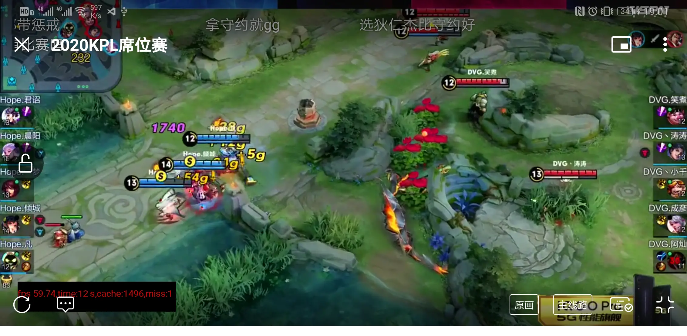

# video 组件

> 用于视频播放



video 组件额外支持设置以下属性：

- `url: Url`: 视频播放地址
- `headers: object`: 设置视频网络请求时的 Http 头

```javascript
{
  // ...
  headers: {
    'User-Agent': 'Dora.js/1.0.2',
    'Cookies': '...'
  }
  // ...
}
```

- `selectors: object[]` 资源选择器，如果视频有不同线路、不同清晰度、不同来源，可以通过 `selectors` 来进行设置
- `startDanmaku()`: 如果希望显示弹幕，可实现这个函数，创建弹幕拉取的相关任务
- `stopDanmaku()`：结束接收弹幕的回调函数，在这个函数里应该释放掉弹幕拉取相关的任务
- `sendDanmaku(content: string)`: 发送弹幕时的回调函数

```javascript
module.exports = {
  type: 'video',
  title: '示例视频',
  danmuScheduler: null,
  fetch() {
    return {
      // url: 'http://devimages.apple.com.edgekey.net/streaming/examples/bipbop_16x9/gear5/prog_index.m3u8',
      url: {
        value:
          'http://devimages.apple.com.edgekey.net/streaming/examples/bipbop_16x9/gear5/prog_index.m3u8',
        headers: {
          'Test-Key': 'Test-Value'
        }
      },
      image:
        'https://goss.veer.com/creative/vcg/veer/800water/veer-310433275.jpg'
    }
  },
  startDanmaku() {
    console.log('startDanmaku')
    var seq = 0
    this.danmuScheduler = setInterval(() => {
      seq++
      this.addDanmaku({
        nick: '测试消息',
        content: `Danmaku ${seq}`
      })
    }, 100)
  },
  stopDanmaku() {
    console.log('stopDanmaku')
    clearInterval(this.danmuScheduler)
  },
  sendDanmaku(message) {
    $ui.toast(`send ${message}`)
  }
}
```

<button class="run-button" onclick="sendDoraEvent('$router.to','video')">点击运行</button>

> [!NOTE]
> 目前仅支持直播弹幕

video 组件提供以下接口:

- `addDanmaku(danmaku: object)`: 添加一条弹幕 ([详情](#adddanmakudanmaku-object))

## selectors: object[]

selectors 接受一个数组，数组条目的数据结构如下：

```javascript
[{
    select: 1, // number, 选中的 option 数组下标，默认为 0
    onSelect: this.onSelectQuaility // function, 当用户选中后，会回调组件的这个方法，会把选中的 option 作为参数传入
    options: [{ // [], 可供选择的项目
        title: '高清', // 选项显示的标题
        value: any // option 的值，可以是任何类型
    },
    // ....
    ]
},
// ...
]
```

例子:

```javascript
module.exports = {
    async fetch() {
        let resp = await $http.get('...')
        return {
            url: resp.data.url,
            isLive: true,
            selectors: [
            {
                title: '清晰度',
                select: 0,
                onSelect: this.onSelectQuaility,
                options: [
                    {
                        title: '高清',
                        value: {
                            baseUrl: 'http://example.com'
                            qs : 1
                        }
                    },
                    {
                        title: '标准',
                        value: {
                            baseUrl: 'http://example.com'
                            qs : 2
                        }
                    }
                ]
            }]
        }
    },
    onSelectQuaility(option) {
        this.url = `${option.baseUrl}?qs=${option.qs}`
    }
}
```

## addDanmaku(danmaku: object)

参数 `danmaku: object` 有以下属性:

- `content: string` 弹幕消息内容
- `color: string|null` 弹幕文字颜色
- `author: Author` 弹幕发送者 ([详情](api/struct#author))

例子：

```javascript
this.addDanmaku({
  content: 'Hello World!'
  color: '#000000',
  author: {
    name: 'test'
  }
})
```
